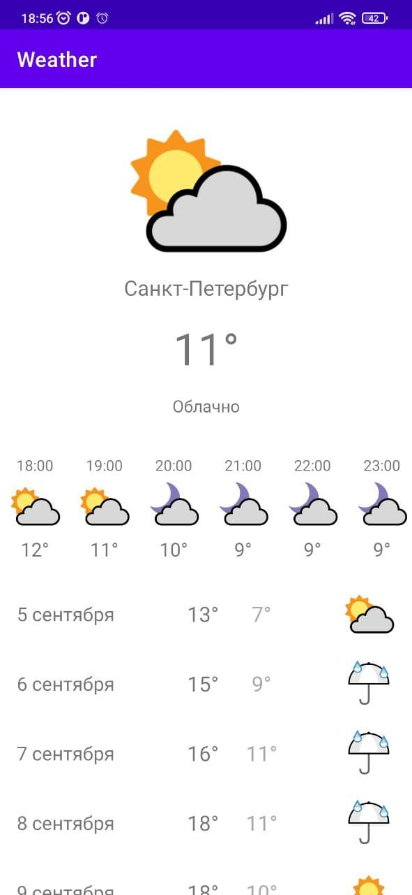

Weather
==============

Weather is an application that shows current, hourly and daily forecasts.
GMS and HMS are used to determine the user's location.
Weather forecast data is obtained from the Dark Sky API.

## Screenshots

 

## TODO

* Migrate from Dark Sky API (until the end of 2022).